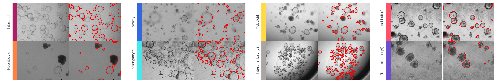

# GOAT: General Organoid Annotation Tool

<br /><br />Official implementation of [GOAT](https://github.com/msknorr/goat-public), a neural network-driven tool for organoid annotation.

GOAT showed high performance and generalization for multiple organoid systems generated
from different tissues, imaging tools and laboratories.


## Requirements

The algorithm was developed and tested on Ubuntu 20.04 and 22.04 with Python 3.6.
For use on Windows be sure to set `num_workers = 0` in `config.py`.

A standard computer with enough RAM is required for inference. For training, a GPU with > 10 GB VRAM is recommended. The algorithm was developed on a RTX 3080. In order to run training on smaller GPUs, it is possible to automatically exclude images with more than X objects by adjusting `restrict_nr` in `config.py`.  

## Installation
```sh
# install pytorch
conda install pytorch torchvision torchaudio cudatoolkit=11.3 -c pytorch
```
```sh
# clone repo
$ git clone https://github.com/msknorr/goat-public
```
```sh
# install requirements
$ cd goat-public
$ pip install -r requirements.txt
```

## Inference

1. Download [weights](https://drive.google.com/file/d/1WvuRfUu613QLxJR2IOsH4wwWxuQ7TJ8p/view?usp=sharing) and specify the path in `config.py`
   ```sh
   model_weights = "[...]/mrcnn-weights.bin"
   ```
2. Run inference. 
   ```sh
   $ python inference.py "./data/" "./output/"
   ```
   Inference on 8 sample images should take 10s on GPU and slightly longer on CPU. 
## Train
###  Training on sample data
This is the fastest way to test the training pipeline.
An example dataframe along with 8 brightfield images can be found in ``/data/``.
For training on this data:
   ```sh
   $ python train.py "./data/imagedata.csv"
   ``` 

###
###  Training on official data 
:soon: *this option will be available soon*

To run training on this dataset, follow these steps:
1. [Download](https://zenodo.org/) the resources folder
2. Copy the `data_paper` folder in `goat-public`
     ```sh
   $ cp -r "[...]/goat_resources/train_val_test/data_paper/" "[...]/goat-public/data_paper/"
   ``` 
3. Start training with

   ```sh
   $ python train.py "./data_paper/imagedata.csv"
   ``` 
Training took approximately 6 hours on a RTX3080 GPU.
###
###  Training on your own data
A dataframe in the following format is required.
   ```sh
            filename   path               kind          state    x       y     width   height   rle
      1     img1       ./data/img1.png    intestinal    train    1292    0     240     162      <...>
      2     img1       ./data/img1.png    intestinal    train    608     486   333     387      <...>
      3     img2       ./data/img2.png    hepatic       val      552     693   248     267      <...>
   ```
- <b>filename</b>: image filename without suffix (e.g. `.png`)
- <b>path</b>: absolute or relative path to image file
- <b>kind</b>: class name
- <b>state</b>: one of train, val, test
- <b>x</b>: bbox x
- <b>y</b>: bbox y
- <b>width</b>: bbox width
- <b>height</b>: bbox height
- <b>rle</b>: Run-Length-Encoded organoid masks relativ to the whole image

## Test
Testing requires a dataframe in the above format.
###  Testing on sample data

1. Download [weights](https://drive.google.com/file/d/1WvuRfUu613QLxJR2IOsH4wwWxuQ7TJ8p/view?usp=sharing) and specify the path in `config.py`
   ```sh
   model_weights = "[...]/mrcnn-weights.bin"
   ```
2. Run on provided data. A result dataframe with metrics and images will be stored in `./output/`.
   ```sh
   $ python test.py "./data/imagedata.csv" "./output/"
   ``` 
   Testing of 8 sample images should take ~60s.

   
## Credits
- [Matterport Mask-RCNN](https://github.com/matterport/Mask_RCNN) -> `mrcnn_utils.py`

## Data Availability
:soon: *this option will be available soon*

``/goat_resources/`` folder structure:

    .
    ├── best-checkpoint-114epoch.bin
    ├── train_val_test                 # labeled train/val/test images
    │   ├── data_paper  
    │   └── output
    ├── Experiment_1                   # EM and DM images
    │   ├── images  
    │   └── output 
    ├── Experiment_2                   # Cytokine matrix
    │   ├── images  
    │   └── output
    └── Expermient_3                   # Reproduction experiment
        ├── images  
        └── output
